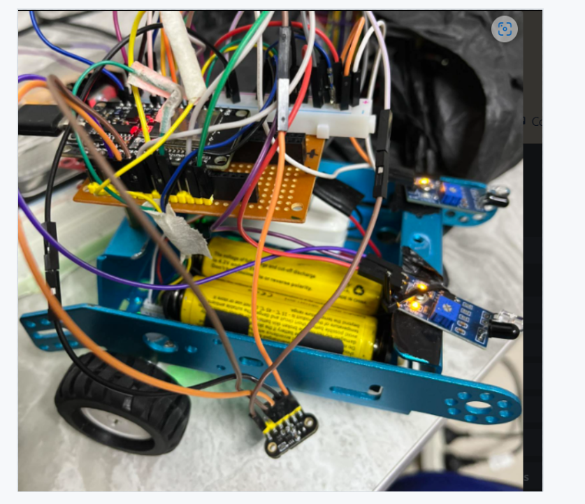
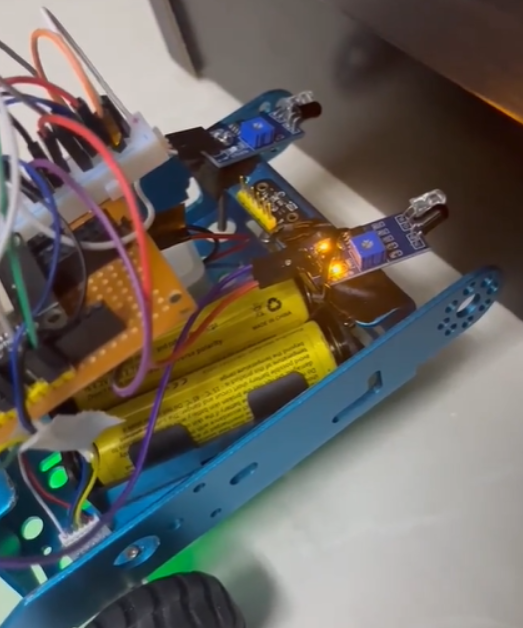

# MicroMouse — Autonomous Maze-Solving Robot

> An Arduino / ESP32-based MicroMouse robot that drives itself through a walled maze using IR + LIDAR sensors, encoder-based closed-loop motor control, and a left-hand wall-follower exploration policy.



Built for the **Interfacing Techniques** course at Birzeit University. The project went from breadboard prototypes → speed-corrected forward motion → wall detection → full left-hand exploration. The repository captures every intermediate firmware checkpoint so the iteration history is preserved.



---

## Tech Stack


---

## Highlights

- **Closed-loop forward motion** — encoder counts and IR distance feedback keep the robot on a straight line and prevent drift over long maze corridors.
- **Wall detection + avoidance** — IR sensors stop the robot before a collision; LIDAR confirms the wall is genuinely in front, not a transient reflection.
- **Left-hand wall-follower** — the canonical maze-solving heuristic, implemented with explicit state transitions for rotate-in-place vs. forward-with-correction.
- **Iterative checkpoints** — each firmware milestone (e.g., `first_demo_flag _speed_correction_works.txt`, `forward with correction demo.txt`) is preserved as a separate file so the bring-up sequence is traceable.

---

## Repository Layout

```
.
├── README.md
├── index.html                                   # Tiny web dashboard for live tuning
├── forward_correction_with_irs&lidar.cpp        # Production forward-motion routine
├── *.txt                                        # Versioned firmware snapshots — see "Iteration log" below
├── WhatsApp_Video_2024-07-12_at_7.18.23_PM.mp4  # Recorded run
├── image.png                                    # Hi-res robot photo
└── docs/
    ├── showcase.png   # Hero shot of the assembled robot
    └── maze.png       # Test maze used during validation
```

### Iteration log (selected firmware snapshots)

| File | Milestone |
| --- | --- |
| `encoders read values .txt` | Initial encoder readout |
| `controlling the speed of the motors.txt` | PWM-based speed control |
| `approximately straight line.txt` | First straight-line motion |
| `forward with correction demo .txt` | Encoder + IR closed-loop forward |
| `STOPPING WHEN SEEING SN OBJECT.txt` | Wall detection / hard stop |
| `flag appraoch speed adjustment.txt` | Speed ramping near walls |
| `only rotating.txt`, `rotate to left the right wheel move other stop .txt` | Rotate-in-place primitives |
| `left hand algorithim with our pins and sensors.txt` | Full wall-follower policy |
| `best_for_now.txt` | Final consolidated firmware |
| `forward_correction_with_irs&lidar.cpp` | Production C++ source |

---

## How to Run

1. Open `best_for_now.txt` (or `forward_correction_with_irs&lidar.cpp` for the production source) in the Arduino IDE.
2. Adjust the pin map at the top of the file to match the physical wiring on your chassis.
3. Flash to the Arduino / ESP32, place the robot inside the maze, and power on.

The Trello board with the original task breakdown lives at <https://trello.com/b/GVlwjuIy/interface-project>.

---

## Course & Acknowledgements

- **Course:** Interfacing Techniques, Birzeit University
- **Team project** — every iteration file represents a real bring-up step, see commit history for who authored which checkpoint.
